# Тестування працездатності системи

## Запуск сервера
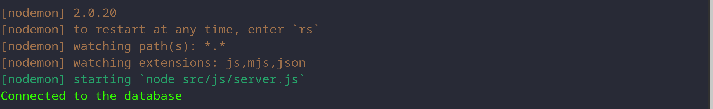
## Cтворення файлу з даними
### Запит
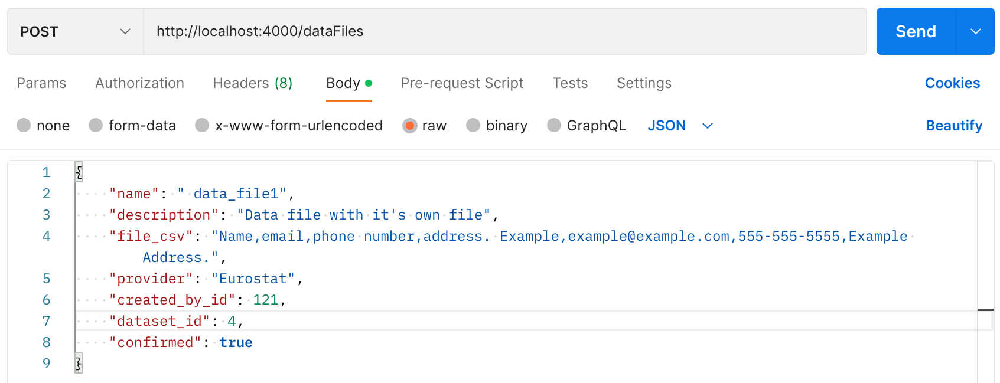
### Результат
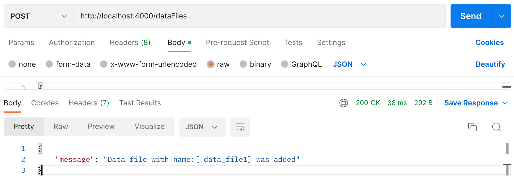
## Вивід всих файлів з даними
### Запит
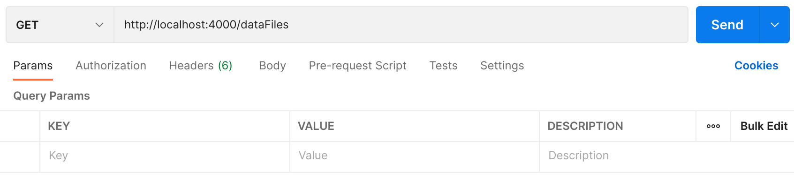
### Результат

## Вивід конкретного файлу з даними (по id)
### Запит
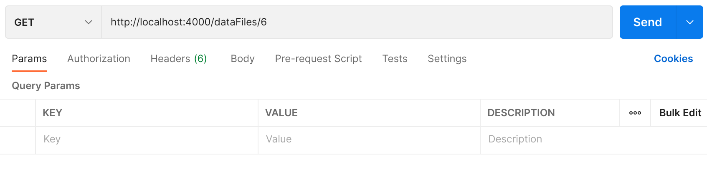
### Результат
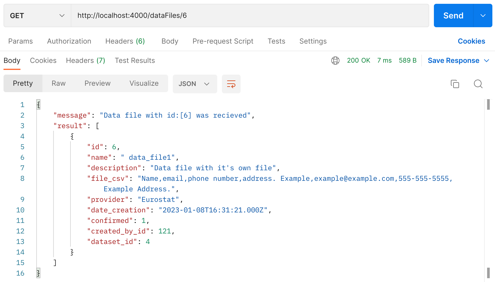
## Оновлення файлу з даними (по id)
### До відновлення
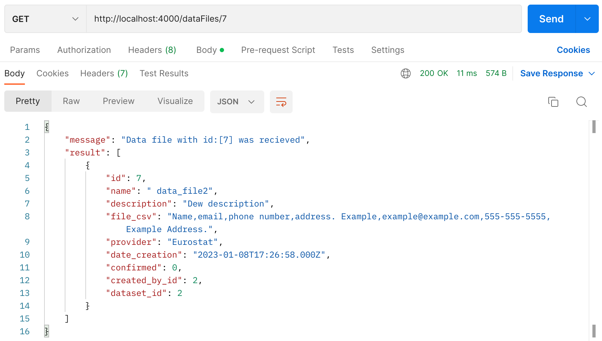
### Запит
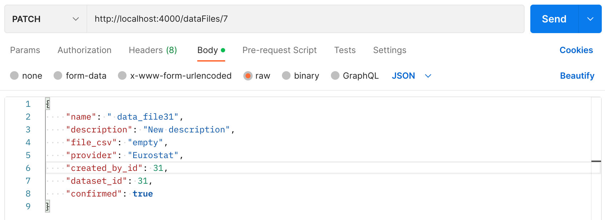
### Відповідь
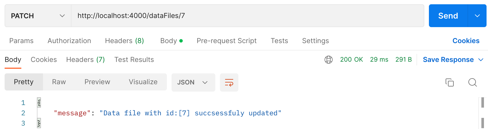
### Результат
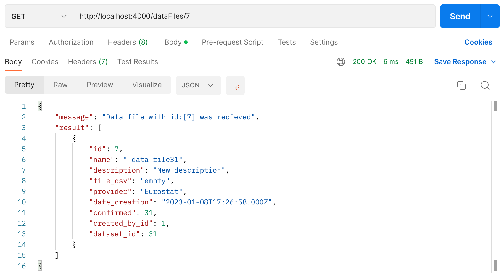
## Видалення файлу з даними (по id)
### Запит
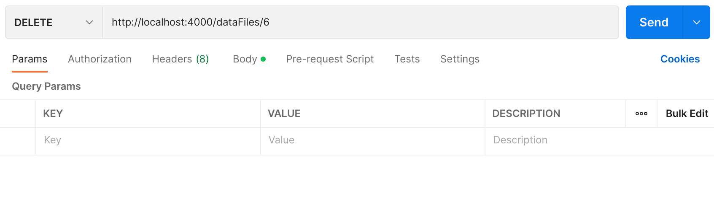
### Відповідь
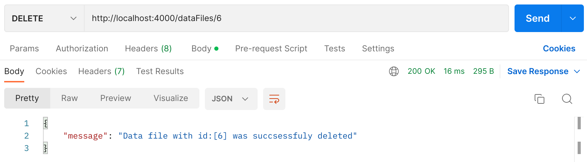
### Результат
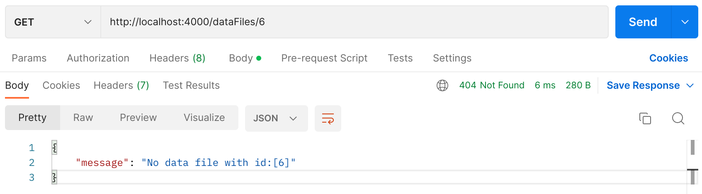
## Помилки
### Немає файлу з потрібним id
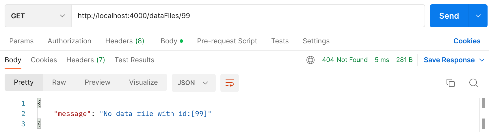
### Зайняте ім'я
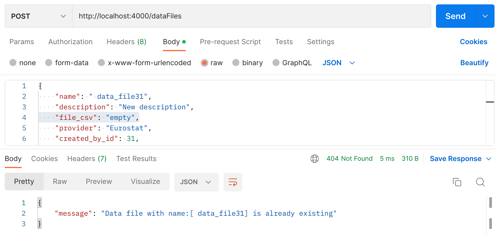
### Потрібні поля не є заповненими
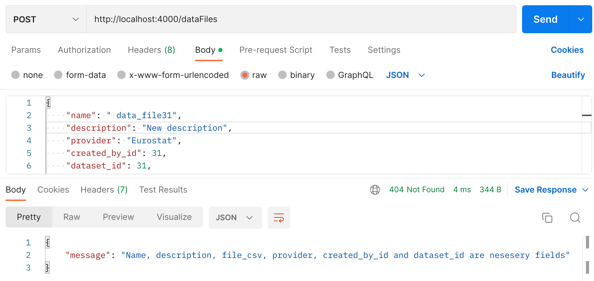

